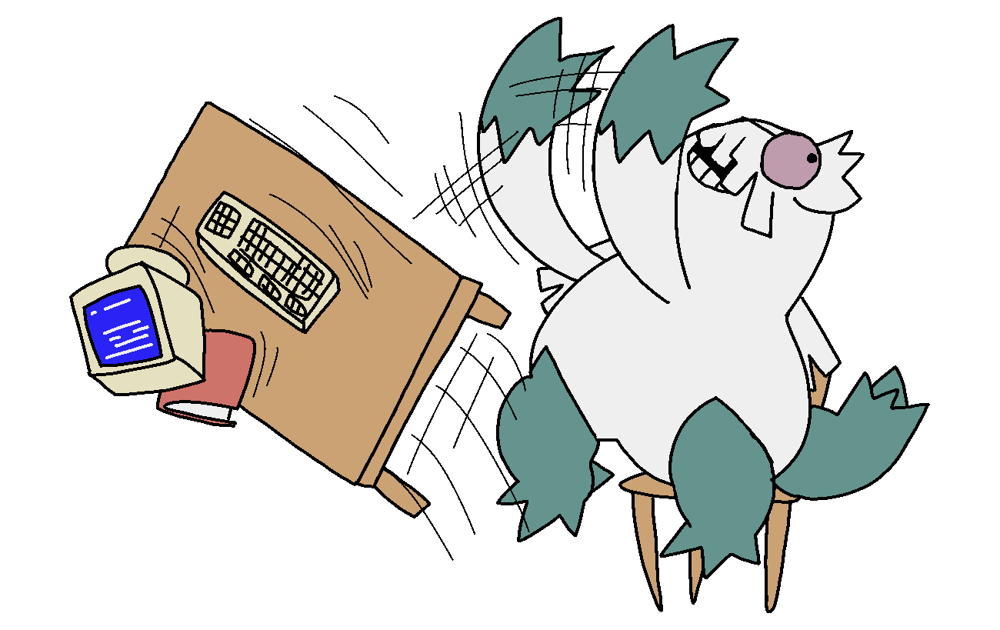

# 

<picture>
  <source
    srcset="https://github-readme-stats.vercel.app/api?username=exurd&show_icons=true&cache_seconds=86400&theme=github_dark&hide_border=true&bg_color=00000000&hide_title=true"
    media="(prefers-color-scheme: dark)"
  />
  <source
    srcset="https://github-readme-stats.vercel.app/api?username=exurd&show_icons=true&cache_seconds=86400&theme=default&hide_border=true&bg_color=00000000&hide_title=true"
    media="(prefers-color-scheme: light), (prefers-color-scheme: no-preference)"
  />
  
</picture>

<!-- for some reason only the ableton icon appears when using <picture> -->
<!-- <picture>
  <source
    srcset="https://skillicons.dev/icons?i=ableton,anaconda,apple,blender,css,docker,git,html,js,linux,lua,md,py,robloxstudio,vscode,windows&perline=8&theme=dark"
    media="(prefers-color-scheme: dark)"
  />
  <source
    srcset="https://skillicons.dev/icons?i=ableton,anaconda,apple,blender,css,docker,git,html,js,linux,lua,md,py,robloxstudio,vscode,windows&perline=8&theme=light"
    media="(prefers-color-scheme: light), (prefers-color-scheme: no-preference)"
  />
  
</picture> -->

## Things I'm working on
* My website
* Preparing myself for a Computer Games Programming course
* Going through the CS50x course
* Completing Advent of Code 2015 (in Python)

## Projects
* [alcubierre](https://github.com/exurd/alcubierre) | A Roblox Badge-to-Badge Place Teleporter (Python)
* [Dumb Badge(s) Remover](https://github.com/exurd/DBR) | Batch remove Roblox Player Badges (Python)
* [Roblox MetaGamerScore Leaderboard](https://github.com/exurd/roblox_mgs_leaderboard) | JSON files of MGS Roblox leaderboard(s) (GitHub Actions, Python)
* [roblox_wb_proxy](https://github.com/exurd/roblox_wb_proxy) | The Wayback Machine as a Roblox API proxy (Luau ModuleScript, Argon)
* [roblox-assets-grab](https://github.com/ArchiveTeam/roblox-assets-grab) | Archive Team Warrior project saving 10,379,367 Roblox assets, 3.32 TiB of data (Lua 5.1)
* [TXT2WARC](https://github.com/exurd/TXT2WARC) | A text file to WARC pipeline for grab-site-docker (Python, Docker)
* [YouTube Into The Archive](https://github.com/exurd/YITA) | Checks if a YT video is on Internet Archive (Chrome Extension)

## Gists
* [custard.user.js](https://gist.github.com/exurd/32f3e889c0f7b4433ee4d475bad9f573) | Custom GitHub profile CSS by creating `.custard/style.css` in your special repository. (Userscript)
* [playrandommeme.py](https://gist.github.com/exurd/c116ece33194980a25241e800749bc00) | Plays a random meme after a random amount of time has passed (Python)
* [Roblox_HighJump_WithGears.ahk](https://gist.github.com/exurd/55efbae38cb68d020c26e144078b0506) | Switching from a jump increase gear to a gravity changing gear mid-jump causes a massive height boost (Roblox, AutoHotKey)
* [Roblox_QuickReset.ahk](https://gist.github.com/exurd/ad6a0fbf222e4b2c8f2b09d1ab61c8fc) | Quickly reset your character in games with no quick reset support (Roblox, AutoHotKey)
* [stemsFromMIDI_BaWaMI.bat](https://gist.github.com/exurd/d986eb093388ec62b014b1145e0b9b4d) | Generate/convert a MIDI file to multiple stems from BaWaMI (Windows Batch)

  

<!-- bottom area -->

  

