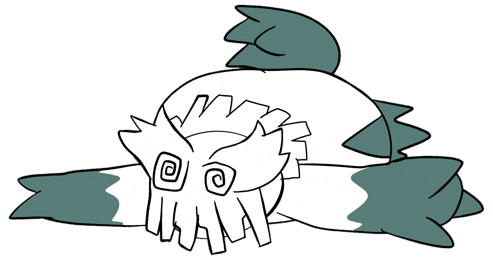

# 

## Projects
* [alcubierre](https://github.com/exurd/alcubierre) | A Roblox Badge-to-Badge Place Teleporter (Python)
* [Roblox MetaGamerScore Leaderboard](https://github.com/exurd/roblox_mgs_leaderboard) | JSON files of MGS Roblox leaderboard(s) (GitHub Actions, Python)
* [Dumb Badge(s) Remover](https://github.com/exurd/DBR) | Batch remove Roblox Player Badges (Python)
* [TXT2WARC](https://github.com/exurd/TXT2WARC) | A text file to WARC pipeline for grab-site-docker (Python, Docker)
* [roblox_wb_proxy](https://github.com/exurd/roblox_wb_proxy) | The Wayback Machine as a Roblox API proxy (Luau ModuleScript, Argon)
* [YouTube Into The Archive](https://github.com/exurd/YITA) | Checks if a YT video is on Internet Archive (Chrome Extension)

## Gists
* [stemsFromMIDI_BaWaMI.bat](https://gist.github.com/exurd/d986eb093388ec62b014b1145e0b9b4d) | Generate/convert a MIDI file to multiple stems from BaWaMI (Windows Batch)
* [Roblox_HighJump_WithGears.ahk](https://gist.github.com/exurd/55efbae38cb68d020c26e144078b0506) | Switching from a jump increase gear to a gravity changing gear mid-jump causes a massive height boost (Roblox, AutoHotKey)
* [Roblox_QuickReset.ahk](https://gist.github.com/exurd/ad6a0fbf222e4b2c8f2b09d1ab61c8fc) | Quickly reset your character in games with no quick reset support (Roblox, AutoHotKey)
* [playrandommeme.py](https://gist.github.com/exurd/c116ece33194980a25241e800749bc00) | Plays a random meme after a random amount of time has passed (Python)

 

  
  
  
<!-- The following image was created by Manhkbrady and is licensed under CC-BY-NC-SA-4.0 (https://creativecommons.org/licenses/by-nc-sa/4.0) -->
  
  

 

<!-- bottom area -->

  

